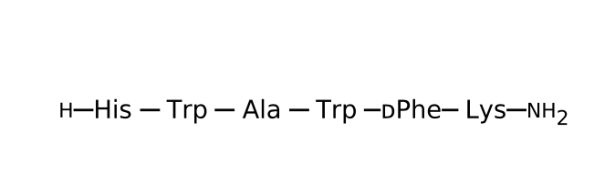
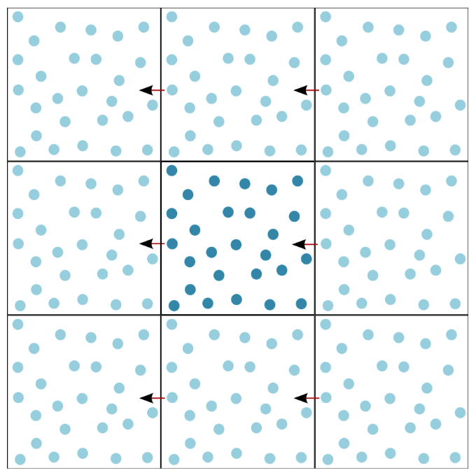

# Monday 10/10/2022

## Get familiar with the model

There is 7 published models in the pdb with **GHS-R**:
- [7F83](https://www.rcsb.org/structure/7F83): Crystal Structure of a receptor in Complex with inverse agonist.
- [6KO5](https://www.rcsb.org/structure/6KO5): Complex structure of ghrelin receptor with Fab.
- [7F9Z](https://www.rcsb.org/structure/7F9Z): GHRP-6-bound Ghrelin receptor in complex with Gq.
- [7NA8](https://www.rcsb.org/structure/7NA8): Structures of human ghrelin receptor-Gi complexes with ghrelin and a synthetic agonist.
- [7F9Y](https://www.rcsb.org/structure/7F9Y): ghrelin-bound ghrelin receptor in complex with Gq.
- [7NA7](https://www.rcsb.org/structure/7NA7): Structures of human ghrelin receptor-Gi complexes with ghrelin and a synthetic agonist.
- [7W2Z](https://www.rcsb.org/structure/7W2Z): Cryo-EM structure of the ghrelin-bound human ghrelin receptor-Go complex.

I first aligned all the models in Pymol, and compared them.

### Issues

We are interested in [7F9Z](https://www.rcsb.org/structure/7F9Z) (see [Article](https://www.nature.com/articles/s41467-021-25364-2)).  

Peptide: **GHRP-6**



This model shows a lot of issues:
- The peptide has **3 Cis peptide bonds**!

- The model used [6KO5](https://www.rcsb.org/structure/6KO5) as a template, which also has a problem since helix 5 shows a shift of half helix turn.   

  

Using VMD, load density CPP4:  

So when we try to fit [7F9Z](https://www.rcsb.org/structure/7F9Z) in the **density map**, the peptide does not fit well, and we notice that the **M213** in helix 5 is not in its place.  
The resolution is reported to be **$3.20Å$**, this is the average value. We can tell that the resolution in the whole model is so much better than in the ligand pocket, suggesting that the resolution is lower for the peptide. So the density map for the peptide is probably for the backbone, explaining the abnormal 3 cis peptide bonds when they tried to fit it with the side chains.  

_Side note:_ The configuration L and D of the lysine in the peptide is so important (switch from agonist to and antagonist respectively)

## Discussion

Got introduced to multiple concepts: 

### Calculations with Floating

One approah is **metadynamics**, at $δt$, Gaussian potentials are dynamically placed on the potential energy landscape in order to flatten energy wells and reduce oversampling of local energy minima. This greatly accelerates the sampling of configuration space.

 


A sketch of the process of metadynamics. First the system evolves according to a normal dynamics, then a Gaussian potential is deposited (solid gray line). This lifts the system and modifies the free-energy landscape (dashed gray line) in which the dynamics evolves. After a while the sum of Gaussian potentials fills up the first metastable state and the system moves into the second metastable basin. After this the second metastable basin is filled, at this point, the system evolves in a flat landscape. The summation of the deposited bias (solid gray profile) provides a first rough negative estimate of the free-energy profile. [ref](https://parrinello.ethz.ch/research/metadynamics.html)

### Periodic Boundary Conditions (PBC)

Make it possible to approximate an infinite system by using a small part (unit cell). A unit cell in MD is usually referred to as periodic box.



To implement PBC, the unit cell is surrounded by translated copies in all directions to approximate an infinitely large system. When one molecule diffuses across the boundary of the simulation box it reappears on the opposite side. 


### Harmonic potential & Morse potential

Two types of bonds are implemented:

- standard harmonic bond _(Note: no factor $ \frac{1}{2} $ in the potential)_:

$$
U_{harm}(r)=k(r-r_{0})^2
$$

- and Morse potential:

$$
U_{morse}(r)=D(1-e^{-\rho(r-r_{0})})^2
$$


### NVE, NVT & NPT

**NVE:** constant number (N), volume (V), and energy (E); the sum of kinetic (KE) and potential energy (PE) is conserved, T and P are unregulated

**NVT:** constant number (N), volume (V), and temperature (T); T is regulated via a thermostat, which typically adds a degree of freedom to the conserved Hamiltonian; for the CPT module in CHARMM, this is a piston whose KE and PE are included in the Hamiltonian; P is unregulated

**NPT:** as for NVT, but pressure (P) is regulated; again, for the CPT module this is one or more pistons whose KE and PE are added to the Hamiltonian

### Cutoff

Cut-off distance in the canonical (NVT) ensemble plays little role in determining the equilibrium structure of fluid if the ensemble has a high density. However, pressures calculated in the same NVT ensembles strongly depend on the cut-off distance used. In the  isothermal–isobaric  (NPT) ensemble, cut-off distance plays a key role in determining fluid equilibrium structure, density and self-diffusion coefficient.

# Tuesday 10/11/2022

- Tried **Charmm Gui** (pdb reader) on chains R & C of [7F9Z](https://www.rcsb.org/structure/7F9Z).

- Did not recognize residues of the peptide because of their weird annotation in the pdb.

- I changed the names in the pdb file but still did not work. (don't know why)

- Decided to try just chain R, but had an error at the end (could not retreive the RCSB sequence)

- We thought it's maybe because of the missing residues (intracellular loop) but does not make so much sense, since Charmm Gui can usualy fill the missing residues.

- We decided to use **Modeller**, to model the loop by homology. For that we had to get rid of ANISOU between ATOM in the pdb  (The ANISOU records present the anisotropic temperature factors.)

- I opened the pdb structure in **VMD** and extracted the coordinates for both chains R & D, and put them in a **.atm file** (similar to pdb but specific to modeller) cf. 7f9z.atm

- Another input in the **.ali file**. In this file we put the sequence of the protein (from uniprot) and a template/s (sequence from pdb file) cf ali.ali 

- Got 20 complete protein-peptide models.

  

# Wednesday  10/12/2022

## Essential points of the article

check ballesteros weinstein numbering.


- Ghrelin receptor is characterized by its high basal activity, with approximately 50% of its maximal capacity in the absence of a ligand

- hermostabilized BRIL at the N-terminus of the ghrelin receptor and applied the NanoBiT tethering strategy to improve complex stability and homogeneity

- The complex structure of the G<sub>q</sub>-coupled ghrelin receptor bound to GHRP-6 was determined by cryo-EM to the resolutions of  3.2Å

- The complex presents canonical folds of seven transmembrane segments with the TMD of the receptors surrounded by an annular detergent micelle mimicking the nat- ural phospholipid bilayer

- GHRP-6 adopts an upside-down binding mode relative to ghrelin, with its C-terminus inserting into the helix bundle and its N-terminus facing the extracellular vestibule

  

Important residues: 

- These mutations of ghrelin receptor decrease the basal activity 

  - A204E		

  - F279L

- The binding pocket is bifurcated into two cavities by a salt bridge between

  -  E124<sup>3.33</sup> 
  -  R283<sup>6.55</sup> 

- Cavity I offers a  hydrophobic environment comprising F279<sup>6.51</sup> , F309<sup>7.39</sup>, F312<sup>7.42</sup>, and Y313<sup>7.43</sup>, of which F279<sup>6.51</sup> and Y313<sup>7.43</sup> are closely related to the activity of GHRP-6
  - accommodates Trp4P of GHRP-6 

- cavity II offers a hydrophobic environment comprising I178<sup>4.60</sup>, L181<sup>4.63</sup>, and F286<sup>6.58</sup>
  - Occupied by D-Phe<sup>5P</sup>
  - D-Phe<sup>5P</sup> forms an extra cation-π interaction with R283<sup>6.55</sup> 

- impair activities of GHRP-6
  - alanine substitutions of I178<sup>4.60</sup>, L181<sup>4.63</sup>, and F286<sup>6.58</sup> all significantly impair activities of GHRP-6, these residues make distinct extents of contributions.
  - In contrast to ghrelin, replacement of I178<sup>4.60</sup> or L181<sup>4.63</sup> by alanine demonstrates a more remarkable decreased GHRP-6’s activity thanF286<sup>6.58</sup>

- D-Trp2P forms an edge-to-face packing with Trp<sup>4P</sup> and establishes a stabilizing intramolecular hydrophobic network with the side-chain of Lys<sup>6P</sup> 
- the side-chain of  Lys<sup>6P</sup>  points to TM2 and forms a stabilizing salt bridge with D99<sup>2.60</sup>,

## Discussion

Afternoon: chose a model, discussed Coarse-grain, Nicolas showed me how to align the model in the membrane and make a simulation with coarse-grain

### Coasre-grain

**Coarse-grained modeling**, **coarse-grained models**, aim at simulating the behaviour of complex systems using their coarse-grained (simplified) representation.  

1 particule (bead) ≈ 3 heavy atoms   

diffusion 8 to 10x faster  

since we have beads and not atoms, we can’t define a SS (no $\Phi$ and $\psi$ angles) so we use Martini force field that adds a type of elastics to maintain the initial structure. This is applied only on the Backbone, no Side Chains (9Å).  

If we want to keep a configuration cis or trans, we should put a contrain in modeller:  

0° for cis and 180° for trans  

### Chose the model

We decided to work with model 9 since it’s the one that has the intracellular loop in the continuity of the helices and to avoid contact with other regions of the receptor.  

We removed the begining and the end of the sequence (the part that we modeled to see that it is a mess)  

we started the sequence at residue 40 (coarse-grain doesn't like to have a proline at the beginning) and ended it at residue 337  

### Align the model in the membrane

Use the script (draw_implicit.tcl) in vmd to draw the membrane  

Display in orthographic  

mouse  &rarr; mode  &rarr; molecule (and swipe the molicule to allign it in the membrane in XY)  

if we want to move the peptide outside the receptor: mouse  &rarr; mode  &rarr; fragment  

When I finish preparing the system: file &rarr; save trajectory &rarr; atoms ALL &rarr; and rename *alligned   

### Simulation:

discuss parameters (add later)

# Thursday  10/13/2022

## Conda and Jupyter

Morning: installed jupyter and conda and prepared an environment 

## My first CG simulation

The one that we did with Nicolas yesterday did not work quite well:  

since the peptide is so hydrophobic, it attached to the membrane and did not go in the binding pocket. So we decided to keep the peptide in the receptor.

afternoon: replicated what we did with nicolas yesterday

To automate the simulation, I wrote a Jupyter Notebook where I put the inputs files and run it. (cg_pipeline.ipynb) 

# Friday  10/14/2022

## Discussion

### OPM?

### QMMM?

### Load multiple trajectories


# Monday  10/17/2022

## Seminar (Justine)

## Discussion

### Index the structure (make_ndx)

### Reimaging/Center (trjconv)

### Align

### Clustering

# Tuesday  10/18/2022


# Wednesday  10/19/2022

## Discussion

### VMD visualization

### RMSD

### Distance, bad variable for clustering

### PMF?


# Thursday 10/20/2022


# Friday 10/21/2022


# iGEM Week


# Wednesday 11/2/2022


# Thursday 11/3/2022

All my simulations are wrong, forgot to remove the charge on N-ter

# Friday 11/4/2022

Started new simus

how did I remove the charge?


# Workshop Week


# Monday  11/14/2022

# Tuesday  11/15/2022

# Wednesday 11/16/2022

# Thursday  11/17/2022

# Friday 11/18/2022


# Monday  11/21/2022

Finally managed to get the most relevant cluster

# Tuesday  11/22/2022


essayer d'installer gromacs + densfit .

https://www.mpinat.mpg.de/grubmueller/densityfitting

le tutoriel de MDFF avec VMD. 

https://www.ks.uiuc.edu/Training/Tutorials/science/mdff/tutorial_mdff-html/


essayer de remapper un modèle en tout atomes.

En local il faut utiliser initram.sh dispo sur le site de martini. Sinon, essayes avec charmm-gui

http://cgmartini.nl/index.php/tools2/resolution-transformation


[Automated cryo-EM structure refinement using correlation-driven molecular dynamics](https://pure.mpg.de/rest/items/item_3031462_3/component/file_3035577/content)  

[Using Molecular Simulation to Model High-Resolution Cryo-EM Reconstructions](https://www.sciencedirect.com/science/article/abs/pii/S0076687915001846?via%3Dihub)


check [this tool](https://smog-server.org/extension/MDfit.html)

and also gromaps

# Wednesday 23/19/2022

[CG to atomistic](https://pubs.acs.org/doi/full/10.1021/ct400617g)


align2sels 3 0 0 "name CA and resid 40 to 241 257 to 335 and chain R" "name BB and resid 40 to 241 257 to 335"


GROMACS COMPILATION

```bash
cmake ..\
-DGMX_BUILD_OWN_FFTW=ON \
-DCMAKE_C_COMPILER=/usr/bin/gcc-6 \
-DCMAKE_CXX_COMPILER=/usr/bin/g++-6 \
-DGMX_BINARY_SUFFIX=_gromaps 
```

make -j 16


DENSFIT

cmake ..  -DCMAKE_EXE_LINKER_FLAGS=-L/home/ali/gromacs_mp/ccp4-8.0/lib:$LD_LIBRARY_PATH -DCMAKE_C_FLAGS="-I $CCP4INC" -DCMAKE_CXX_FLAGS="-I $CCP4INC"  -DCMAKE_C_COMPILER=/usr/bin/gcc-7 -DGMX_BUILD_OWN_FFTW=ON


```bash
cmake ..  -DCMAKE_EXE_LINKER_FLAGS=-L/home/ali/gromacs_mp/ccp4-8.0/lib:$LD_LIBRARY_PATH -DCMAKE_C_FLAGS="-I $CCP4INC" -DCMAKE_CXX_FLAGS="-I $CCP4INC"  -DCMAKE_C_COMPILER=/usr/bin/gcc-6 -DCMAKE_CXX_COMPILER=/usr/bin/g++-6 -DGMX_BUILD_OWN_FFTW=ON 
```


# Thursday  11/24/2022

Try again installing gromacs + densfit

```bash
export LD_LIBRARY_PATH=/home/ali/gromacs_mp/ccp4-8.0/lib:$LD_LIBRARY_PATH
```

```bash
CCP4INC=/home/ali/gromacs_mp/ccp4-8.0/include/ccp4/
```

```bash
cmake .. \
-DCMAKE_EXE_LINKER_FLAGS=-L/home/ali/gromacs_mp/ccp4-8.0/lib \
-DCMAKE_C_FLAGS="-I $CCP4INC" \
-DCMAKE_CXX_FLAGS="-I $CCP4INC" \
-DCMAKE_C_COMPILER=/usr/bin/gcc-6 \
-DCMAKE_CXX_COMPILER=/usr/bin/g++-6 \
-DGMX_BUILD_OWN_FFTW=ON \
-DGMX_BINARY_SUFFIX=_df 

```

```bash
make -j 16
```


For gromaps: (this works)

```bash
cmake .. \
-DGMX_BUILD_OWN_FFTW=ON \
-DREGRESSIONTEST_DOWNLOAD=OFF \
-DGMX_BUILD_UNITTESTS=ON \
-DGMX_GPU=OFF \
-DCMAKE_C_COMPILER=/usr/bin/gcc-7 \
-DREGRESSIONTEST_PATH=/home/michael/PROGRAMMES/gromacs-2019.1/build/tests/regressiontests-2019.1/ \
-DCMAKE_CXX_COMPILER=/usr/bin/g++-7
```

# Monday 11/28/2022

make [CG2AT2](https://github.com/owenvickery/cg2at) work.

stop and try to install gromaps again (worked),  updated the command from last week


# Wednesday 30/19/2022

Depuis hier soir j'ai planché sur comment changer les coordonnées d'une carte de densité pour l'aligner sur nos modèles en MD.

Voici la procédure.

Nicolas

il faut créer un modèle aligné et non aligné sur la carte (le deuxième est aligné en xyz pour fitter avec la membrane)
Il faut aligner les deux modèles (celui non aligné sur la membrane sur  l'autre) et enregistrer les infos de la matrice de transformation 

Il faut ensuite appliquer cette matrice de transformation à la carte pour l'aligner sur le modèle utilisé pour les calculs
On peut utiliser l'outil VOLTOOL dans VMD (il faut installer la dernière version de VMD).

En utilisant le script align2.tcl : 

proc align { molId selText molIdRef } {
  set all [atomselect $molId "all"]
  set ref [atomselect $molIdRef $selText]
  set actuel [atomselect $molId $selText]
  set trans_mat [measure fit $actuel $ref]
  puts "$trans_mat"
  $all move $trans_mat
}

je fait (en tcl dans vmd) align 0 "name CA" 1 avec l'objet 0 le modele non aligné sur la membrane et l'objet 1 le modèle aligné sur la membrane
Le script me donne :
{0.1835557222366333 0.6410499811172485 -0.745226263999939 84.7039794921875}  {-0.9673156142234802 0.252715140581131 -0.020870547741651535  88.53860473632813} {0.17495089769363403 0.7246999144554138  0.6664849519729614 -156.47666931152344} {0.0 0.0 0.0 1.0}


C'est la matrice de transformation qu'il faut appliquer à la carte.
dans la doc de voltool on peut lire : move -mat 4x4 transform matrix [-i  input density map] [-mol molid ] [ -vol volume ID] [-o output file]:  apply specified 4x4 transformation matrix to density 

je fais donc :

voltool move -mat {{0.1835557222366333 0.6410499811172485 -0.745226263999939  84.7039794921875} {-0.9673156142234802 0.252715140581131  -0.020870547741651535 88.53860473632813} {0.17495089769363403  0.7246999144554138 0.6664849519729614 -156.47666931152344} {0.0 0.0 0.0  1.0}} -i emd_31501.ccp4 -o map_aligned.dx

la carte en.dx est alignée sur le modèle de départ de la dynamique, donc  avec le plan de la membrane. On peut donc l'utiliser comme contrainte  pour fitter / scorer des modèles issus de MD.

Normalement on peut y appliquer un masque pour ne garder que la partie qui nous  intéresse, je vais regarder ça cet après midi (avec le même outil  voltool de gromacs).


```tcl
source align_2selections.tcl
```

```tcl
align2sels 0 1 0 "name BB and resid 40 to 241 257 to 335" "name CA and resid 40 to 241 257 to 335 and chain R"
```

{0.18988360464572906 0.6351232528686523 -0.7487073540687561 43.49410629272461} {-0.9664700031280518 0.2551766037940979 -0.028646977618336678 124.29756927490234} {0.17285823822021484 0.7290427684783936 0.6622813940048218 -96.94597625732422} {0.0 0.0 0.0 1.0}

```tcl
voltool move -mat {{0.18988360464572906 0.6351232528686523 -0.7487073540687561 43.49410629272461} {-0.9664700031280518 0.2551766037940979 -0.028646977618336678 124.29756927490234} {0.17285823822021484 0.7290427684783936 0.6622813940048218 -96.94597625732422} {0.0 0.0 0.0 1.0}} -i /home/ali/qbio_Lab2/pdb_structures/emd_31501.ccp4 -o map_aligned.dx
```


```tcl
set sel [atomselect top "name CA and within 5 of (resid 367 to 372)"]
```

```tcl
measure minmax $sel
```

```tcl
voltool crop -amt {{26.576316833496094 56.31255340576172 11.772480010986328} {35.10041046142578 63.75132751464844 29.43816375732422}} -mol 7 -o test.dx
```


