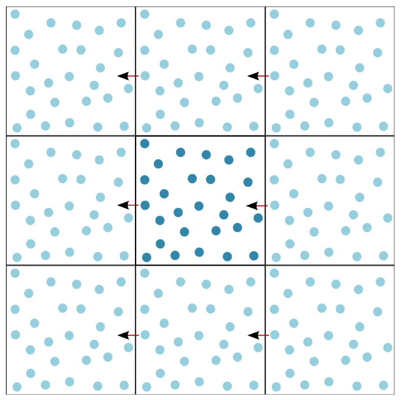

# Monday 10/10/2022

## Get familiar with the model

There is 7 published models in the pdb with **GHS-R**:
- [7F83](https://www.rcsb.org/structure/7F83): Crystal Structure of a receptor in Complex with inverse agonist.
- [6KO5](https://www.rcsb.org/structure/6KO5): Complex structure of ghrelin receptor with Fab.
- [7F9Z](https://www.rcsb.org/structure/7F9Z): GHRP-6-bound Ghrelin receptor in complex with Gq.
- [7NA8](https://www.rcsb.org/structure/7NA8): Structures of human ghrelin receptor-Gi complexes with ghrelin and a synthetic agonist.
- [7F9Y](https://www.rcsb.org/structure/7F9Y): ghrelin-bound ghrelin receptor in complex with Gq.
- [7NA7](https://www.rcsb.org/structure/7NA7): Structures of human ghrelin receptor-Gi complexes with ghrelin and a synthetic agonist.
- [7W2Z](https://www.rcsb.org/structure/7W2Z): Cryo-EM structure of the ghrelin-bound human ghrelin receptor-Go complex.

I first aligned all the models in Pymol, and compared them.

### Issues

We are interested in [7F9Z](https://www.rcsb.org/structure/7F9Z) (see [Article](https://www.nature.com/articles/s41467-021-25364-2)).  

This model shows a lot of issues:
- The peptide has **3 Cis peptide bonds**!

- The model used [6KO5](https://www.rcsb.org/structure/6KO5) as a template, which also has a problem since helix 5 shows a shift of half helix turn.   

  

Using VMD, load density CPP4:  

So when we try to fit [7F9Z](https://www.rcsb.org/structure/7F9Z) in the **density map**, the peptide does not fit well, and we notice that the **M213** in helix 5 is not in its place.  
The resolution is reported to be **$3.20Å$**, this is the average value. We can tell that the resolution in the whole model is so much better than in the ligand pocket, suggesting that the resolution is lower for the peptide. So the density map for the peptide is probably for the backbone, explaining the abnormal 3 cis peptide bonds when they tried to fit it with the side chains.  

_Side note:_ The configuration L and D of the lysine in the peptide is so important (switch from agonist to and antagonist respectively)

## Discussion

Got introduced to multiple concepts: 

### Calculations with Floating

One approah is **metadynamics**, at $δt$, Gaussian potentials are dynamically placed on the potential energy landscape in order to flatten energy wells and reduce oversampling of local energy minima. This greatly accelerates the sampling of configuration space.

 

A sketch of the process of metadynamics. First the system evolves according to a normal dynamics, then a Gaussian potential is deposited (solid gray line). This lifts the system and modifies the free-energy landscape (dashed gray line) in which the dynamics evolves. After a while the sum of Gaussian potentials fills up the first metastable state and the system moves into the second metastable basin. After this the second metastable basin is filled, at this point, the system evolves in a flat landscape. The summation of the deposited bias (solid gray profile) provides a first rough negative estimate of the free-energy profile. [ref](https://parrinello.ethz.ch/research/metadynamics.html)

### Periodic Boundary Conditions (PBC)

Make it possible to approximate an infinite system by using a small part (unit cell). A unit cell in MD is usually referred to as periodic box.

To implement PBC, the unit cell is surrounded by translated copies in all directions to approximate an infinitely large system. When one molecule diffuses across the boundary of the simulation box it reappears on the opposite side. 

### NVE, NVT & NPT

**NVE:** constant number (N), volume (V), and energy (E); the sum of kinetic (KE) and potential energy (PE) is conserved, T and P are unregulated

**NVT:** constant number (N), volume (V), and temperature (T); T is regulated via a thermostat, which typically adds a degree of freedom to the conserved Hamiltonian; for the CPT module in CHARMM, this is a piston whose KE and PE are included in the Hamiltonian; P is unregulated

**NPT:** as for NVT, but pressure (P) is regulated; again, for the CPT module this is one or more pistons whose KE and PE are added to the Hamiltonian

### Harmonic potential & Morse potential

Two types of bonds are implemented:

- standard harmonic bond _(Note: no factor $\frac{1}{2}$ in the potential)_:

 $$ U_{harm}(r)=k(r-r_{0})^2$$

- and Morse potential:

$$U_{morse}(r)=D(1-e^{-\rho(r-r_{0})})^2$$

### Cutoff

# Tuesday 10/11/2022

- Tried **Charmm Gui** (pdb reader) on chains R & C of [7F9Z](https://www.rcsb.org/structure/7F9Z).

- Did not recognize residues of the peptide because of their weird annotation in the pdb.

- I changed the names in the pdb file but still did not work. (don't know why)

- Decided to try just chain R, but had an error at the end (could not retreive the RCSB sequence)

- We thought it's maybe because of the missing residues (intracellular loop) but does not make so much sense, since Charmm Gui can usualy fill the missing residues.

- We decided to use **Modeller**, to model the loop by homology. For that we had to get rid of ANISOU between ATOM in the pdb  (The ANISOU records present the anisotropic temperature factors.)

- I opened the pdb structure in **VMD** and extrcted the coordinates for both chains R & D, and put them in a **.atm file** (similar to pdb but specific to modeller) cf. 7f9z.atm

- Another input in the **.ali file**. In this file we put the sequence of the protein (from uniprot) and a template/s (sequence from pdb file) cf ali.ali 

- Got 20 complete protein-peptide models.

  

# Wednesday  10/12/2022

Morning: read the article

Afternoon: chose a model, discussed Coarse-grain, Nicolas showed me how to align the model in the membrane and make a simulation with coarse-grain

# Thursday  10/13/2022

Morning: installed jupyter and conda and prepared an environment 

afternoon: replicated what we did with nicolas yesterday

# Friday  10/14/2022

