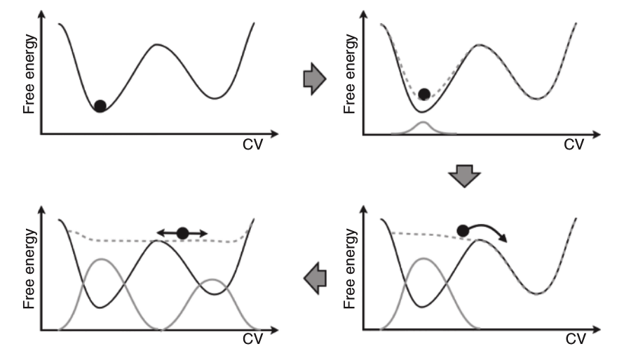

# Monday 10/10/2022

## Get familiar with the model

There is 7 published models in the pdb with **GHS-R**:
- [7F83](https://www.rcsb.org/structure/7F83): Crystal Structure of a receptor in Complex with inverse agonist.
- [6KO5](https://www.rcsb.org/structure/6KO5): Complex structure of ghrelin receptor with Fab.
- [7F9Z](https://www.rcsb.org/structure/7F9Z): GHRP-6-bound Ghrelin receptor in complex with Gq.
- [7NA8](https://www.rcsb.org/structure/7NA8): Structures of human ghrelin receptor-Gi complexes with ghrelin and a synthetic agonist.
- [7F9Y](https://www.rcsb.org/structure/7F9Y): ghrelin-bound ghrelin receptor in complex with Gq.
- [7NA7](https://www.rcsb.org/structure/7NA7): Structures of human ghrelin receptor-Gi complexes with ghrelin and a synthetic agonist.
- [7W2Z](https://www.rcsb.org/structure/7W2Z): Cryo-EM structure of the ghrelin-bound human ghrelin receptor-Go complex.

I first aligned all the models in Pymol, and compared them.

### Issues

We are interested in [7F9Z](https://www.rcsb.org/structure/7F9Z) (see [Article][9]).  

This model shows a lot of issues:
- The peptide has **3 Cis peptide bonds**!

- The model used [6KO5](https://www.rcsb.org/structure/6KO5) as a template, which also has a problem since helix 5 shows a shift of half helix turn.   

  

Using VMD, load density CPP4:  

So when we try to fit [7F9Z](https://www.rcsb.org/structure/7F9Z) in the **density map**, the peptide does not fit well, and we notice that the **M213** in helix 5 is not in its place.  
The resolution is reported to be **3.20Å**, this is the average value. We can tell that the resolution in the whole model is so much better than in the ligand pocket, suggesting that the resolution is lower for the peptide. So the density map for the peptide is probably for the backbone, explaining the abnormal 3 cis peptide bonds when they tried to fit it with the side chains.  

_Side note:_ The configuration L and D of the lysine in the peptide is so important (switch from agonist to and antagonist respectively)

## Discussion

Got introduced to multiple concepts: 

### Calculations with Floating

One approah is **metadynamics**, at $$δt$$, Gaussian potentials are dynamically placed on the potential energy landscape in order to flatten energy wells and reduce oversampling of local energy minima. This greatly accelerates the sampling of configuration space.

 

A sketch of the process of metadynamics. First the system evolves according to a normal dynamics, then a Gaussian potential is deposited (solid gray line). This lifts the system and modifies the free-energy landscape (dashed gray line) in which the dynamics evolves. After a while the sum of Gaussian potentials fills up the first metastable state and the system moves into the second metastable basin. After this the second metastable basin is filled, at this point, the system evolves in a flat landscape. The summation of the deposited bias (solid gray profile) provides a first rough negative estimate of the free-energy profile. [ref](https://parrinello.ethz.ch/research/metadynamics.html)

- NVT & NPT
- PBD
- Harmonic potential
- Morse potential 
- Cutoff

# Tuesday 10/11/2022

